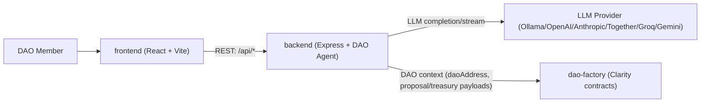

# Stacks AI DAO Monorepo

This repository contains three coordinated packages:

- `dao-factory`: Clarity smart contracts and contract tests for DAO governance primitives on Stacks.
- `backend`: Node.js/TypeScript API that wraps LLM providers and exposes DAO governance assistant endpoints.
- `frontend`: React + Vite dashboard that calls the backend API for health checks, proposal analysis, and chat.

## Repository Layout

| Package | Path | Purpose |
|---|---|---|
| Smart Contracts | `dao-factory` | DAO core, proposal, voting, treasury, and extension contracts with Clarinet/Vitest tests |
| API Service | `backend` | DAO AI Agent API, provider abstraction (`ollama`, `openai`, `anthropic`, `together`, `groq`) |
| Web App | `frontend` | Governance dashboard UI that consumes backend endpoints |

## How the Packages Fit Together

1. `dao-factory` defines on-chain governance behavior and treasury logic in Clarity.
2. `backend` provides AI-assisted analysis and chat endpoints that are DAO-focused.
3. `frontend` presents proposals and assistant interactions, and calls backend endpoints over HTTP.
4. DAO contract state and identities can be passed through API payloads (for example `daoAddress`) so off-chain assistant logic can stay context-aware.

## Architecture Diagram



## Local Development

### Prerequisites

- Node.js 20+ (recommended)
- npm

### 1) Backend

```bash
cd backend
cp .env.example .env
npm install
npm run dev
```

Backend runs on `http://localhost:3001` by default.

### 2) Frontend

```bash
cd frontend
npm install
npm run dev
```

If needed, set API URL in `frontend/.env`:

```bash
VITE_API_URL=http://localhost:3001
```

### 3) DAO Contracts

```bash
cd dao-factory
npm install
npm test
```

Note: `dao-factory/settings/Mainnet.toml` and `dao-factory/settings/Testnet.toml` are gitignored because they may contain mnemonics. Use `dao-factory/settings/Mainnet.toml.example` and `dao-factory/settings/Testnet.toml.example` as templates.

## Test Commands

- Backend: `cd backend && npm test`
- DAO contracts: `cd dao-factory && npm test`
- Frontend: no test suite configured yet

## Useful Docs

- Backend package docs: `backend/README.md`
- Frontend package docs: `frontend/README.md`
