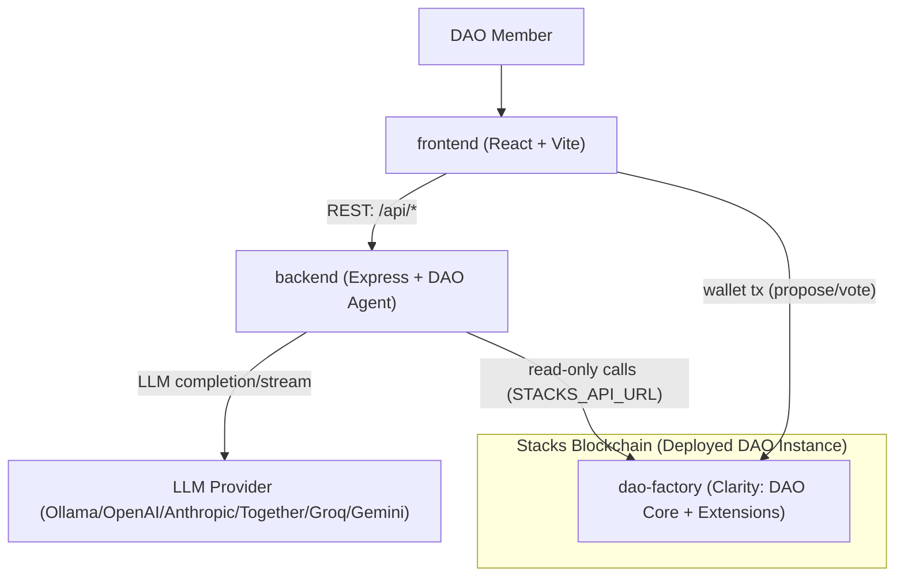

# Stacks AI DAO Monorepo

This repository contains three coordinated packages:

- `dao-factory`: Clarity smart contracts and contract tests for DAO governance primitives on Stacks.
- `backend`: Node.js/TypeScript API that wraps LLM providers and exposes DAO governance assistant endpoints.
- `frontend`: React + Vite dashboard that calls the backend API for health checks, proposal analysis, and chat.

## Repository Layout

| Package | Path | Purpose |
|---|---|---|
| Smart Contracts | `dao-factory` | DAO core, proposal, voting, treasury, and extension contracts with Clarinet/Vitest tests |
| API Service | `backend` | DAO AI Agent API, provider abstraction (`ollama`, `openai`, `anthropic`, `together`, `groq`) |
| Web App | `frontend` | Governance dashboard UI that consumes backend endpoints |

## How the Packages Fit Together

1. `dao-factory` defines on-chain governance behavior and treasury logic in Clarity.
2. `backend` exposes:
   - DAO registry from the on-chain factory (`GET /api/daos`)
   - read-only on-chain DAO state (`GET /api/dao/*`)
   - heuristic risk scanning and alerts (`GET /api/dao/alerts`)
   - AI endpoints (`POST /api/analyze-proposal`, `POST /api/voting-recommendation`, `POST /api/analyze-treasury`, `POST /api/chat`) that pull live on-chain context before prompting the LLM.
   - builds DAO contract IDs using the `-v2` contract set by default (for the latest mainnet deployment)
3. `frontend` presents proposals and assistant interactions, consumes `/api/dao/*` and `/api/dao/alerts` for real on-chain state, and uses wallet transactions for proposal creation and voting.

## Architecture Diagram



## Current Mainnet Deployment (February 16, 2026)

- Network: `mainnet`
- Deployer: `SP1MTYHV6K2FNH3QNF4P5QXS9VJ3XZ0GBB5T1SJPK`
- Active contract set: `-v2`
- Core contract IDs:
  - `SP1MTYHV6K2FNH3QNF4P5QXS9VJ3XZ0GBB5T1SJPK.dao-core-v2`
  - `SP1MTYHV6K2FNH3QNF4P5QXS9VJ3XZ0GBB5T1SJPK.proposal-submission-v2`
  - `SP1MTYHV6K2FNH3QNF4P5QXS9VJ3XZ0GBB5T1SJPK.proposal-voting-v2`
  - `SP1MTYHV6K2FNH3QNF4P5QXS9VJ3XZ0GBB5T1SJPK.governance-token-v2`
  - `SP1MTYHV6K2FNH3QNF4P5QXS9VJ3XZ0GBB5T1SJPK.treasury-v2`
  - `SP1MTYHV6K2FNH3QNF4P5QXS9VJ3XZ0GBB5T1SJPK.dao-factory-v2`

## Local Development

### Prerequisites

- Node.js 20+ (recommended)
- npm

### 1) Backend

```bash
cd backend
cp .env.example .env
npm install
npm run dev
```

Backend runs on `http://localhost:3001` by default.

#### Multi-DAO Mode (Registry)

If you deploy multiple DAOs and register them in the `dao-factory-v2` contract, the backend can list/switch DAOs via the factory registry:

- `GET /api/daos` lists registered DAOs
- all `/api/dao/*` endpoints accept `?daoId=<number>` to target a specific DAO

Configure in `backend/.env`:

- `DAO_FACTORY_CONTRACT_ID` (optional, defaults to `${DAO_DEPLOYER_ADDRESS}.dao-factory-v2`)
- `DAO_DEFAULT_ID` (optional, selects the default DAO from the registry)

### 2) Frontend

```bash
cd frontend
npm install
npm run dev
```

If needed, set API URL in `frontend/.env`:

```bash
VITE_API_URL=http://localhost:3001
```

### 3) DAO Contracts

```bash
cd dao-factory
npm install
npm test
```

Deploy the versioned `v2` contracts on mainnet:

```bash
cd dao-factory
clarinet check -m Clarinet.v2.toml
clarinet deployments generate --mainnet --manual-cost -m Clarinet.v2.toml
clarinet deployments apply --mainnet -d --no-dashboard -m Clarinet.v2.toml
```

For low stable fees, set `deployment_fee_rate = 2` in `dao-factory/settings/Mainnet.toml`.

Note: `dao-factory/settings/Mainnet.toml` and `dao-factory/settings/Testnet.toml` are gitignored because they may contain mnemonics. Use `dao-factory/settings/Mainnet.toml.example` and `dao-factory/settings/Testnet.toml.example` as templates.

## Test Commands

- Backend: `cd backend && npm test`
- DAO contracts: `cd dao-factory && npm test`
- Frontend: `cd frontend && npm run lint && npm run build` (no test suite configured yet)

## Useful Docs

- Backend package docs: `backend/README.md`
- Frontend package docs: `frontend/README.md`
